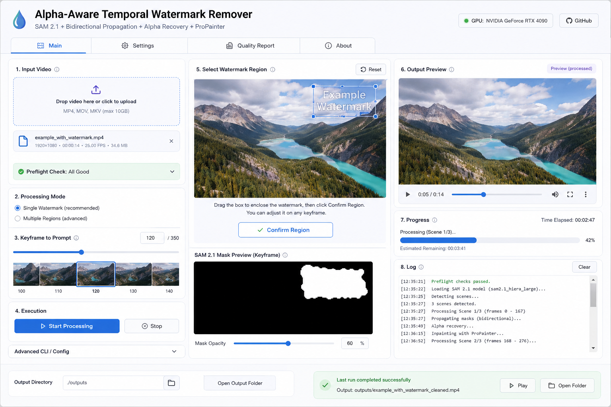

# Alpha-Aware Temporal Watermark Remover

Version **1.2.0** — a maintainable Python pipeline for removing watermarks from **video you own or have permission to edit**.

The project combines alpha-aware inverse compositing, scene-aware temporal analysis, optical-flow alignment, residual AI inpainting with ProPainter, bounded-memory processing, disk-space preflight checks, and an optional local Gradio UI.

## What’s new in 1.2.0

- **Optional Gradio UI** for upload, preview, region/mask selection, tuning, processing and result download.
- **Disk-space preflight checks** before frame extraction and inference.
- **OpenCV 5 support** via `opencv-python>=4.8,<6` while retaining OpenCV 4 compatibility.
- **Expanded tests** for disk preflight and UI-to-pipeline configuration/delegation.
- **Updated GitHub Actions dependencies** and the existing CI/security gates remain in place.

See [`RELEASE_NOTES_1.2.0.md`](RELEASE_NOTES_1.2.0.md) for the full release notes.

## Highlights

- **Alpha-aware recovery** — analytically reconstructs pixels where watermark opacity and confidence allow it.
- **Residual AI inpainting** — sends only uncertain pixels to ProPainter instead of regenerating the whole marked region.
- **Scene-aware processing** — temporal windows stay inside detected visual shots.
- **Optical-flow alignment** — neighbouring frames are warped before temporal background estimation.
- **Bounded RAM usage** — processing is chunked instead of loading the full video into memory.
- **Flexible masks** — per-frame masks or a rectangular fallback region through the `MaskProvider` strategy.
- **Disk-space preflight** — checks scratch and output capacity before expensive work begins.
- **Local web UI** — optional Gradio interface built as a thin adapter over the same pipeline used by the CLI.
- **Production-oriented CI** — Ruff, mypy, pytest/coverage, Bandit, pip-audit, packaging checks and CodeQL.

## How it works

A translucent watermark can be approximated by:

```text
O = αF + (1 - α)B
```

where `O` is the observed pixel, `α` the watermark opacity, `F` the watermark colour and `B` the hidden background.

When `α` and `F` can be estimated:

```text
B = (O - αF) / (1 - α)
```

The inverse becomes unstable as `α` approaches `1`, so the pipeline calculates confidence and routes uncertain pixels to ProPainter instead of trusting the analytic reconstruction.

```text
Input video
    │
    ▼
Disk-space preflight
    │
    ▼
FFmpeg frame extraction
    │
    ▼
Scene-cut detection
    │
    ▼
Bounded scene chunks
    │
    ├── MaskProvider → support mask
    │
    └── neighbouring frames
              │
              ▼
       optical-flow alignment
              │
              ▼
       temporal background median
              │
              ▼
       alpha + foreground estimate
              │
              ▼
         inverse compositing
              │
       ┌──────┴────────┐
       ▼               ▼
confident pixels   uncertain pixels
analytic recovery  residual AI mask
       │               │
       └──────┬────────┘
              ▼
         ProPainter
              │
              ▼
     original audio restored
              │
              ▼
      cleaned video + CSV report
```

## Installation

Python 3.10 or newer is required.

Core package:

```bash
pip install -e .
```

Optional UI:

```bash
pip install -e ".[ui]"
```

Development tools:

```bash
pip install -e ".[dev]"
```

Install FFmpeg separately and verify it is available:

```bash
ffmpeg -version
```

Install ProPainter separately according to its upstream instructions and licence terms.

## Local Gradio UI

Launch the optional UI with:

```bash
watermark-remove-ui
```

The UI exposes video upload/preview, ProPainter and output paths, per-frame masks, custom watermark-region coordinates, scene/chunk/temporal controls, motion compensation, alpha/confidence tuning, ProPainter memory controls, FP16/debug options, processed-video preview and quality-report download.

<p align="center">
  
</p>

The UI deliberately delegates to `PipelineConfig` and `WatermarkRemovalPipeline`; processing logic is not duplicated.

See [`UI.md`](UI.md) for detailed setup and deployment/security guidance.

## Command-line usage

With per-frame masks:

```bash
watermark-remove input.mp4 \
  --propainter ./ProPainter \
  --mask-dir ./sam_masks \
  --fp16
```

With a known region:

```bash
watermark-remove input.mp4 \
  --propainter ./ProPainter \
  --x 1115 --y 540 --w 125 --h 130 \
  --fp16
```

If neither masks nor explicit coordinates are supplied, the pipeline uses its default bottom-right fallback region.

## Key processing controls

```bash
--chunk-size 24
--temporal-radius 2
--scene-threshold 0.62
--min-scene-length 10
--alpha-inpaint 0.55
--analytic-confidence-min 0.28
--residual-dilate 3
--neighbor-length 6
--ref-stride 14
--resize-ratio 0.75
--fp16
```

Optical-flow alignment is enabled by default; disable it with:

```bash
--no-motion-compensation
```

## Disk-space preflight

Before processing, the pipeline estimates scratch and destination requirements. The estimate accounts for materialized source/intermediate frames, optional debug output and a conservative output reserve.

If capacity is insufficient, the run fails early with required and available space reported in human-readable units instead of failing late after extraction or inference.

## Mask providers

Mask acquisition is separated from orchestration:

```text
MaskProvider
├── RegionMaskProvider
└── DirectoryMaskProvider
```

`DirectoryMaskProvider` can fall back to a region mask when a per-frame mask is missing. This keeps future integrations such as a direct SAM 2.1 provider isolated from the core pipeline.

## Memory characteristics

For each scene chunk the pipeline loads approximately:

```text
process frames + left temporal overlap + right temporal overlap
```

For example, a chunk size of 24 with temporal radius 2 loads roughly 28 decoded frames for a normal interior chunk. RAM use therefore scales with chunk size rather than total video duration.

## Quality report

Each successful run produces a CSV containing frame index, support-mask pixel count, residual inpainting pixel count, mean estimated alpha, mean analytic confidence and residual fraction.

## Package structure

```text
watermark_remover/
├── alpha.py            # alpha estimation and inverse compositing
├── chunks.py           # bounded scene chunk planning
├── cli.py              # CLI argument handling
├── disk.py             # disk-space estimation and preflight
├── infra.py            # subprocess + ProPainter adapter
├── mask_providers.py   # MaskProvider strategies
├── masks.py            # mask primitives
├── models.py           # typed configuration/value objects
├── motion.py           # optical-flow alignment
├── pipeline.py         # orchestration
├── ports.py            # protocols
├── reporting.py        # CSV quality reporting
├── scenes.py           # hard scene-cut detection
├── ui.py               # optional Gradio UI
└── video.py            # probing, extraction and audio muxing
```

## Tests and quality checks

```bash
pytest
pytest --cov=watermark_remover --cov-report=term-missing
ruff check .
mypy watermark_remover
```

The suite covers alpha math, residual masks, chunk/scene isolation, optical flow, mask providers, reporting, ProPainter adapter validation, pipeline temporal windows, disk preflight and UI-to-pipeline mapping/delegation.

## Continuous integration and security

Every push to `main` and pull request is checked with dependency consistency, Ruff, mypy, tests on Python 3.10 and 3.12, branch coverage, Bandit, pip-audit, package build/metadata checks and CodeQL. Dependabot monitors Python dependencies and GitHub Actions.

## Remaining improvements

Useful next steps include resumable scene/chunk checkpoints, an interactive mask editor, direct `Sam21MaskProvider` integration, structured run manifests/logging, GPU integration tests, and container/lockfile reproducibility.

## Limitations

Alpha and watermark colour cannot generally be uniquely recovered from a single composite image. Optical flow can fail around occlusion, large motion, severe blur, repeated textures and abrupt lighting changes. No inpainting method can guarantee recovery of information that was never visible in any source frame.

Use this tool only on material you own or have permission to modify.

## Licence

The source code in this repository is licensed under the MIT License; see [`LICENSE`](LICENSE).

Third-party components are governed by their own licences. Installing or invoking ProPainter, SAM 2/2.1, FFmpeg, Gradio or other external software does **not** make those components MIT-licensed. Review their current licence terms before commercial use, redistribution or deployment.

Security reporting guidance is documented in [`SECURITY.md`](SECURITY.md).
